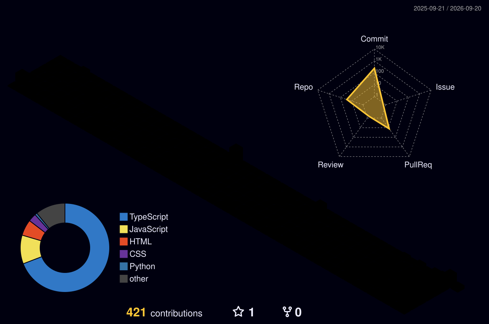

<!-- ===================== HERO BANNER ===================== -->

 

 

<!-- ===================== ABOUT ME ===================== -->
## 🧠 About Me

Hello! I'm **Bajjuri Rithish**, a 17-year-old young entrepreneur based in **Hyderabad, India**. I'm passionate about building solutions that make a real impact. As a **Guinness World Record holder** for being the youngest to launch startups made solo, I've turned my vision into reality through dedication and innovation.

I founded my own **clothing brand** and have developed multiple projects including AI assistants, websites for NGOs and schools, a comprehensive JEE and NEET preparation platform, and a real-time dashboard for **Kochi Metro Rail Limited**. My expertise spans full-stack development, AI integration, and automation. Beyond coding, I'm also a skilled public speaker, inspiring others to pursue their entrepreneurial dreams.

- 🎯 **Career Goals:** Partnering with industry-leading corporations to drive high-impact initiatives through specialized freelance engagements — leveraging enterprise scale and resources while delivering agile, expert solutions on a project-by-project basis.
- 💡 **Interests:** Full-Stack Development · AI Integration & Automation · Public Speaking
- 🎓 **Education:** B.Tech in Information Technology, VIT Vellore
- ⚡ **Fun Fact:** I'm a Guinness World Record holder for being the youngest to launch startups made solo!

 

<!-- ===================== TECH STACK ===================== -->
## 🛠️ Technical Skills

<!-- 👉 Add/remove badges here as your skills grow -->

**Languages**
 

**Frontend**
 

**Backend**
 

**Databases**
 

**Tools & Platforms**
 

 

<!-- ===================== FEATURED PROJECTS ===================== -->
## 🚀 Featured Projects
> Building solutions that make a real impact

<!-- 👉 Update the GitHub/Live links below to your actual project URLs -->

<table>
<tr>
<td width="50%" valign="top">

### 🤖 AI Assistant
Advanced AI-powered assistant for automating tasks and providing intelligent responses.

`Python` `AI/ML` `NLP`

</td>
<td width="50%" valign="top">

### 🎙️ Real-Time AI Voice Assistant
Own AI-powered voice assistant with real-time speech recognition and intelligent responses.

`AI/ML` `Speech Recognition` `Python`

</td>
</tr>

<tr>
<td width="50%" valign="top">

### 🌐 NGO & School Websites
Professional websites for non-profit organizations and educational institutions.

`React` `Node.js` `MongoDB`

</td>
<td width="50%" valign="top">

### 📚 JEE & NEET Prep Platform
Comprehensive online learning platform for 11th and 12th grade competitive exam preparation.

`Next.js` `PostgreSQL` `Django`

</td>
</tr>

<tr>
<td width="50%" valign="top">

### 🚇 KMRL Dashboard
Real-time dashboard for Kochi Metro Rail Limited operations and analytics.

`React` `TypeScript` `Real-time Data`

</td>
<td width="50%" valign="top">

### ✋ GesturePod
Send text and images without touching a thing, using gesture recognition technology.

`Computer Vision` `AI/ML` `Python`

</td>
</tr>

<tr>
<td width="50%" valign="top">

### 🔎 DeepWork AI
AI agent that thinks and researches in real-time — scanning 15–20 trusted sources, cross-checking facts, and filtering misinformation.

`AI Agent` `Web Scraping` `NLP`

</td>
<td width="50%" valign="top">

### 🔄 SwapHands
A marketplace designed specifically for hostellers to buy, sell, and exchange items.

`React` `Node.js` `E-commerce`

</td>
</tr>

<tr>
<td width="50%" valign="top">

### 📝 DevNotes
Helped 1000+ university students with a comprehensive website covering all tech stack notes.

`Education` `Web Dev` `Documentation`

</td>
<td width="50%" valign="top">

### 👕 Clothing Brand
Founded and launched my own clothing brand with a full e-commerce platform.

`E-commerce` `Entrepreneurship`

</td>
</tr>

<tr>
<td width="50%" valign="top">

### ⚙️ Workflow Automation
Automated business workflows and repetitive tasks for maximum efficiency.

`Python` `Automation` `APIs`

</td>
<td width="50%" valign="top">

### 🖱️ Auto-Scroll System
Intelligent auto-scrolling solution with smart content detection and speed control.

`JavaScript` `Automation`

</td>
</tr>
</table>

 

<!-- ===================== GITHUB STATS ===================== -->
## 📊 GitHub Stats

 

 

 

<!-- ===================== CONTRIBUTION GRAPH ===================== -->
## 🐍 Contribution Graph

<picture>
  <source media="(prefers-color-scheme: dark)" srcset="https://raw.githubusercontent.com/Rithish-2914/Rithish-2914/output/github-contribution-grid-snake-dark.svg" />
  <source media="(prefers-color-scheme: light)" srcset="https://raw.githubusercontent.com/Rithish-2914/Rithish-2914/output/github-contribution-grid-snake.svg" />
  
</picture>

  

 

<!-- ===================== ACHIEVEMENTS ===================== -->
## 🏆 Achievements & Certifications

**Achievements**
- 🌍 **Guinness World Record Holder** — Youngest to Launch Startups Made Solo
- 🚀 **Young Entrepreneur** — Founded a clothing brand and multiple tech startups at age 17
- 💻 **Full-Stack Developer** — Proficient in 15+ modern technologies and frameworks
- 🎤 **Global Speaker** — Speaking at hackathons, colleges, and tech events nationwide
- 🗣️ **Public Speaker** — Sharing my entrepreneurial journey and inspiring young minds

**Certifications**
- 📢 **Google Digital Marketing** — Fundamentals of Digital Marketing
- 🐍 **Python Programming Essentials (PCAP)** — Cisco Networking Academy & OpenEDG
- 📊 **Python for Data Science** — IBM Cognitive Class

 

<!-- ===================== CURRENTLY LEARNING ===================== -->
## 📚 Currently Learning

- 🤖 Agentic AI
- 🌍 Developing Real-World Problem Solutions

 

<!-- ===================== COLLABORATION ===================== -->
## 🤝 Open to Collaborate On

- 🌐 Open-source projects
- 💼 Freelance opportunities
- 🔬 Research projects
- 🚀 Startup ideas

 

<!-- ===================== CONNECT ===================== -->
## 📫 Connect With Me

  

**Thanks for stopping by — let's build something impactful together! 🚀**

